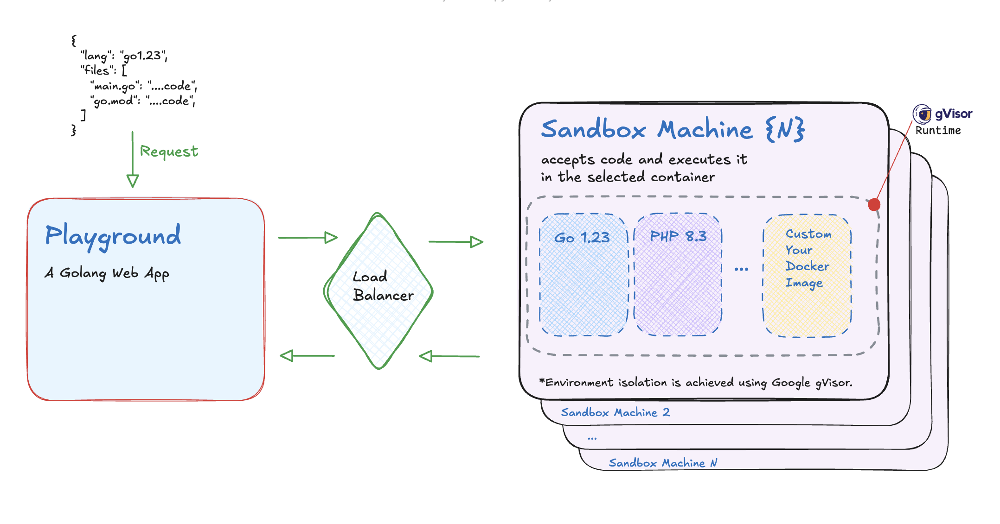

# Сodenire Playground

Open-source online code execution system featuring 
a playground and sandbox. 
Built on Docker images with robust isolation provided by [Google gVisor](https://github.com/google/gvisor). 

The system is easily extensible with additional technologies and languages.

Inspired by:
- Judje0 Playground: https://github.com/judge0/judge0
- Google Playground: https://github.com/golang/playground


# Infrastructure Schema




# Sandbox Provision Containers Schema


**[!] The ability to register Docker images via API is not yet implemented and will be available in the near future!**

Out of the box (in development), 
Dockerfiles and configurations for various languages can be found in the repository: https://github.com/codiewio/dockerfiles

# Usage Playground

```
POST https://codenire.com/run
Content-Type: application/json

{
  "templateId": "php8.3",

  "args": "--name \"Elon Mask\" -age=45",

  "files": {
    "index.php": "<?php\n// /index.php\n\n// Some comment\n require_once __DIR__ . '/src/foo.php';\nrequire_once __DIR__ . '/src/bar/bar.php';\n\n// Call functions\n$resultFoo = foo();\n$resultBar = bar();\n\n// Calculate\n$product = $resultFoo * $resultBar;\n\n// Result\nvar_dump($product);",
    "src/foo.php": "<?php\n\nfunction foo() {\n    return 20;\n}",
    "src/bar/bar.php": "<?php\n\nfunction bar() {\n    return 3;\n}"
  }
}
```

# Run/Set Up
You can Run Playground local (or on MacOS/Ubuntu) via Docker Compose. 

**[!] If you start on MacOS you can't start with gVisor Environment**

```yaml
services:
  playground:
    container_name: play_dev
    build:
      context: .
      dockerfile: Dockerfile
    ports:
      - "8081:8081"
    volumes:
      # You can set up your path with go-plugin 
      - ./var/plugin/plugin:/plugin
      # You can set up your path with plugin scripts (see docs/docker-compose dir with examples)
      - ./var/plugin/hooks-dir:hooks-dir
    restart: always
    networks:
      - "sandnet"
    entrypoint: [
      "/playground",
      "--backend-url", "http://sandbox_dev/run",
      "--port", "8081",
      "--hooks-plugins", "/plugin",
#      "--hooks-dir", "/hooks-dir",
    ]

  sandbox:
    container_name: sandbox_dev
    build:
      context: ./sandbox
      dockerfile: Dockerfile
    ports:
      - "80:80"
    volumes:
      - /var/run/docker.sock:/var/run/docker.sock
      # You can set up your path with configs 
      - ./var/dockerfiles:/dockerfiles
    networks:
      - sandnet
    restart: always
    entrypoint: [
      "/usr/local/bin/sandbox",
      "--dockerFilesPath", "/dockerfiles",
      "--replicaContainerCnt", "1",
      "--port", "80",
    ]

networks:
  sandnet:
    name: codenire


```

# Deploy

- Docker compose (see [/docs/docker-compose](https://github.com/codiewio/codenire/tree/main/docs/docker-compose) dir — without external gVisor Runtime)
- [Digital Ocean Terraform](docs/digitalocean/README.md) with load balancing and multi-sandbox cluster


# Lifecycle Request Hooks

TODO:: add description
