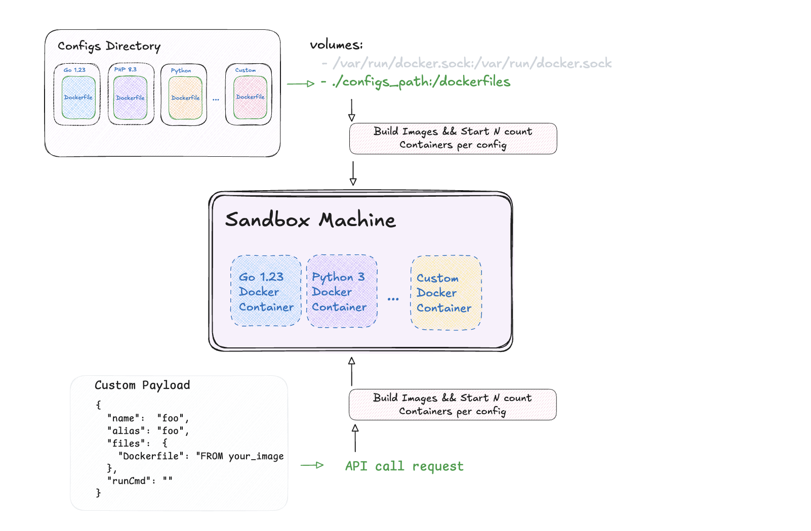

# Сodenire Playground

Open-source online code execution system featuring 
a playground and sandbox. 
Built on Docker images with robust isolation provided by Google gVisor. 

The system is easily extensible with additional technologies and languages.


# Infrastructure Schema


# Sandbox Provision Containers Schema



[*] The ability to run Docker images via API is not yet implemented and will be available in the near future!

Out of the box (in development), 
Dockerfiles and configurations for various languages can be found in the repository: 

https://github.com/codiewio/dockerfiles

# Deploy

- Docker compose (see /docs/docker-compose dir)
- [Digital Ocean Terraform](docs/digitalocean/README.md)

# Usage Playground

```
POST https://codenire.com/run
Content-Type: application/json

{
  "templateId": "php8.3",

  "args": "--name \"Elon Mask\" -age=45",

  "files": {
    "index.php": "<?php\n// /index.php\n\n// Some comment\n require_once __DIR__ . '/src/foo.php';\nrequire_once __DIR__ . '/src/bar/bar.php';\n\n// Call functions\n$resultFoo = foo();\n$resultBar = bar();\n\n// Calculate\n$product = $resultFoo * $resultBar;\n\n// Result\nvar_dump($product);",
    "src/foo.php": "<?php\n\nfunction foo() {\n    return 20;\n}",
    "src/bar/bar.php": "<?php\n\nfunction bar() {\n    return 3;\n}"
  }
}
```
