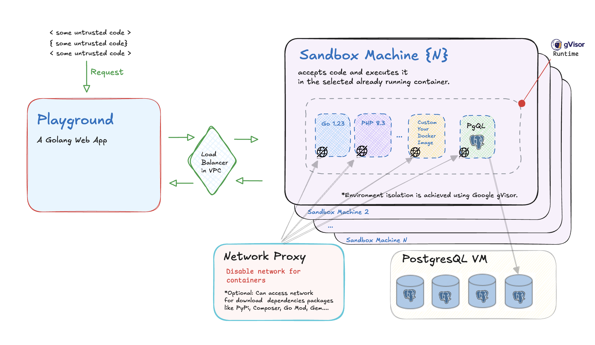
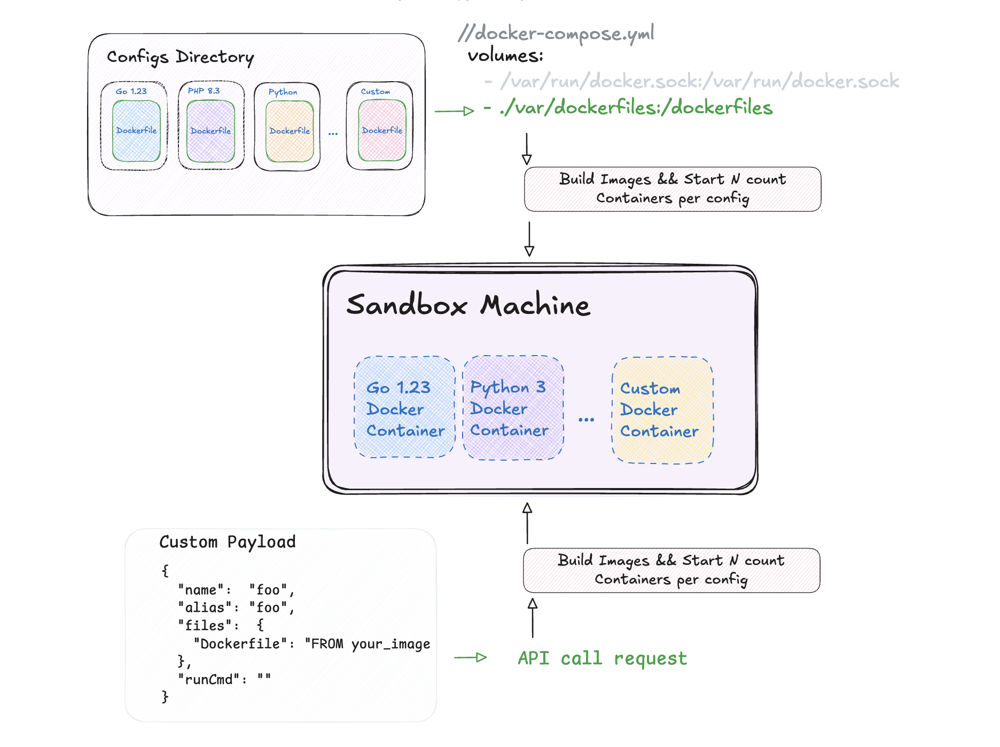

# Сodenire Playground

Open-source online code execution system featuring
a playground and sandbox.
Built on Docker images with robust isolation provided by [Google gVisor](https://github.com/google/gvisor).

The system is easily extensible with additional technologies and languages.

Inspired by:
- Judje0 Playground: https://github.com/judge0/judge0
- Google Playground: https://github.com/golang/playground

But created for more extensible  


<a href="https://codiew.io/ide" target="_blank">
  
</a>


*Playground demonstration in the [codiew.io/ide](https://codiew.io/ide)


# 🌟Features

- Multi-Language Support: Run Python, Go, PHP and Node.js or your built code with others configurations and versions what you can think, in isolated Docker containers.
- Multi-Files Support: Run code that consists of multiple files.
- Easy extensible: You can create your own build to run code via API or by loading a folder with configurations at startup.
- (in working) Dependency Management: Automatic handling of project dependencies (pip, go mod, npm).
- Flexible Execution: Custom entrypoints for both single-file code and full projects.
- Scalable System: Expandable via a load balancer between a playground and a sandbox.
- Security: You can accept JWTS signed external system (Supabase JWT Secret Token for example)
- PostgresQL supported
- CORS supported

<details><summary>Languages (updating...)</summary>
<div>
  <p>🔥🔥🔥 PostgresQL</p>
  <p>Bash</p>
  <p>PHP 8.3</p>
  <p>PHP 8.4</p>
  <p>Python 3.12</p>
  <p>Python 2.7</p>
  <p>C++23</p>
  <p>C++20</p>
  <p>C++17</p>
  <p>C++14</p>
  <p>C++11</p>
  <p>Ruby 2.7</p>
  <p>Ruby 3.3</p>
  <p>Kotlin 2.1.10</p>
  <p>Golang 1.23.6</p>
  <p>Golang 1.24.0</p>
  <p>Rust 1.84</p>
  <p>Rust 1.84 (with Cargo)</p>
  <p>Typescript 5.7 (with built-in tsconfig.json if you not provide)</p>
</div>
</details>

# 🐙Infrastructure Schema

   <details><summary>Why need isolation</summary>
    <p>
    // TODO::
   </p>
    </details>




# Sandbox Provision Templates Schema



**[!] The ability to register Docker images via API is not yet implemented and will be available in the near future!**

Out of the box (in development),
Dockerfiles and configurations for various languages can be found in /sandbox/dockerfiles

# Usage Playground

```
# Input request result:

POST https://codenire.io/run
Content-Type: application/json

{
  "templateId": "golang_1_23",
  "files": {
    "main.go": "package main\n\nimport (\n\t\"flag\"\n\t\"fmt\"\n)\n\nfunc main() {\n\t// Process command-line arguments\n\tname := flag.String(\"name\", \"default\", \"User name\")\n\tflag.Parse()\n\n\t// Read data from stdin\n\tvar input string\n\t_, err := fmt.Scan(&input)\n\tif err != nil {\n\t\tfmt.Println(\"Error reading from stdin:\", err)\n\t\treturn\n\t}\n\n\t// Print arguments and stdin data\n\tfmt.Printf(\"Hello, %s!\\n\", *name)\n\tfmt.Printf(\"Stdin data: %s\\n\", input)\n}\n"
  },
  "args": "--name \"Mark\"",
  "stdin": "100.00"
}


# Output result:

{
  "Events": [
    {
      "Kind": "stdout",
      "Message": "Hello, Mark!\nStdin data: 100.00\n"
    }
  ]
}
```

# API Docs

Full API spec available here: https://codiewio.github.io/codenire/api/

# Run/Set Up
You can Run Playground local (or on MacOS/Ubuntu) via Docker Compose.

**[!] If you start on MacOS you can't start with gVisor Environment**

```yaml
services:
  playground:
    container_name: play_dev
    build:
      context: .
      dockerfile: Dockerfile
    ports:
      - "8081:8081"
    restart: always
    networks:
      - "sandnet"
    entrypoint: [
      "/playground",
      "--backend-url", "http://sandbox_dev/run",
      "--port", "8081",
    ]

  sandbox:
    container_name: sandbox_dev
    build:
      context: ./sandbox
      dockerfile: Dockerfile
    ports:
      - "8082:80"
    volumes:
      - /var/run/docker.sock:/var/run/docker.sock
      # You can set up your path with configs 
      - ./var/dockerfiles:/dockerfiles
    networks:
      - sandnet
    restart: always
    entrypoint: [
      "/usr/local/bin/sandbox",
      "--dockerFilesPath", "/dockerfiles",
      "--replicaContainerCnt", "1",
      "--port", "80",
    ]

networks:
  sandnet:
    name: codenire


```

# Deploy

- Docker compose (see [/docs/docker-compose](https://github.com/codiewio/codenire/tree/main/docs/docker-compose) dir — without external gVisor Runtime)
- [Digital Ocean Terraform](infra/digitalocean/README.md) with load balancing and multi-sandbox cluster

# Roadmap
- [x] Add MultiFiles/singe scripts
- [x] Add gVisor Isolation
~~- [x] Add Hooks to catch/override some request (for auth, for handle code in external system)~~
- [x] Add Multi actions in once container (different runs in one docker img, for example multi version of c++ in cpp container)
- [ ] Add WebUI Head with Monaco
- [ ] Add Metrics
- [ ] Add Tests
- Add GoLinter
  - [x] Playground
  - [x] Sandbox
- [ ] Add debug info in API req/resp
- [x] Change container replica strategy
- [ ] Add StateFull sandbox
- [x] Compile with open network
- [ ] Add WS messaging
- [ ] Add action create route
- [ ] Add out provider of templates (S3...) 
